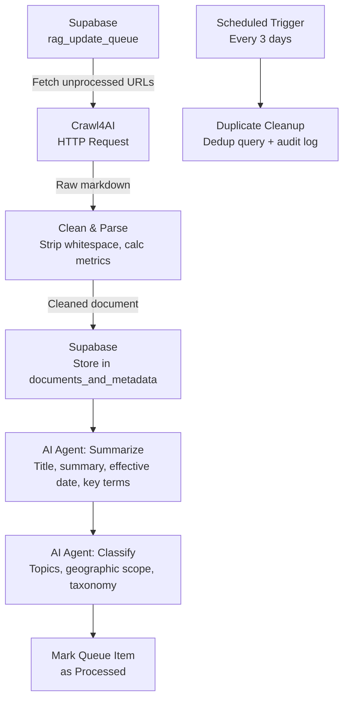

# URL-to-Document RAG Pipeline Feeder

[]()
[]()
[]()
[]()
[]()

An n8n workflow that automatically converts URLs into RAG-ready documents with AI-generated metadata, built for environmental compliance document management.

## Architecture



## What It Does

This pipeline processes a queue of URLs and produces structured, searchable documents for a RAG system. It fetches unprocessed URLs from Supabase, crawls each page via Crawl4AI for markdown conversion, cleans the output, then runs two LLM agents — one to extract metadata (title, summary, effective date, key terms) and another to classify documents using an environmental compliance taxonomy. A separate sub-workflow deduplicates the queue on a 3-day schedule.

## Tech Stack

- **[n8n](https://n8n.io/)** — Workflow automation engine
- **[Crawl4AI](https://github.com/unclecode/crawl4ai)** — Web crawling and markdown extraction
- **[Supabase](https://supabase.com/)** — PostgreSQL database for queue and document storage
- **[OpenRouter](https://openrouter.ai/)** — LLM API gateway for metadata extraction

## Installation

1. Clone the repository:
   ```bash
   git clone https://github.com/benaiahbrown/URL-to-document_RAG_pipeline.git
   cd URL-to-document_RAG_pipeline
   ```
2. Import `URL_to_Document.json` into your n8n instance (Settings → Import Workflow)
3. Copy `.env.example` to `.env` and fill in your credentials
4. Configure n8n credentials:
   - **Supabase** — project URL and service key
   - **OpenRouter** — API key
   - **Postgres** — direct connection string (for the dedup query)
5. Update the Crawl4AI URL in the HTTP Request node to point to your instance
6. Create the required database tables in Supabase (see Database Tables below)
7. Activate the workflow

## Environment Setup

Copy `.env.example` to `.env` and provide the following values:

| Variable | Description | Where to Get It |
|----------|-------------|-----------------|
| `SUPABASE_URL` | Your Supabase project URL | Supabase Dashboard → Settings → API |
| `SUPABASE_SERVICE_KEY` | Supabase service role key | Supabase Dashboard → Settings → API |
| `OPENROUTER_API_KEY` | OpenRouter API key for LLM calls | [openrouter.ai/keys](https://openrouter.ai/keys) |
| `CRAWL4AI_HOST` | Hostname/IP of your Crawl4AI server | Your self-hosted Crawl4AI instance |
| `POSTGRES_CONNECTION_STRING` | Direct Postgres connection string | Supabase Dashboard → Settings → Database |

## Database Tables

| Table | Purpose |
|-------|---------|
| `rag_update_queue` | Incoming URLs to process (`source_url`, `processed`, `flagged_at`) |
| `documents_and_metadata` | Processed documents with full metadata |
| `duplicate_cleanup_log` | Audit log for the deduplication sub-workflow |

## Usage Examples

Add a URL to the queue in Supabase:

```sql
INSERT INTO rag_update_queue (source_url, processed)
VALUES ('https://www.epa.gov/example-regulation', false);
```

After the workflow runs, the processed document appears in `documents_and_metadata`:

```json
{
  "source_url": "https://www.epa.gov/example-regulation",
  "title": "Clean Water Act Section 404 Permit Guidelines",
  "summary": "Federal guidelines for Section 404 dredge-and-fill permits under the Clean Water Act...",
  "effective_date": "2024-01-15",
  "key_terms": ["Section 404", "dredge and fill", "wetlands", "USACE"],
  "main_topics": ["Water Quality", "Wetlands", "NPDES"],
  "geographic_scope": "National",
  "word_count": 4230,
  "file_size_kb": 18.4
}
```

## Topic Taxonomy

The classification agent categorizes documents across these dimensions:

- **Jurisdictions** — Federal, EPA, state-level (AL, FL, GA, MS, NC, SC, TN)
- **Resources** — Water Quality, Stormwater, Wetlands, Air Quality, Wildlife, etc.
- **Programs** — NPDES, Section 404, CWA, NEPA, ESA, etc.
- **Activities** — Construction, Permits, Development, Mining, etc.
- **Doc Types** — Regulation, Guidance, Court Decision, Proposed Rule, etc.
- **Geographic Scope** — National, Regional, State-specific, Multi-State, Local

## Roadmap

- Add batch processing mode for bulk URL imports
- Support PDF and file-based document ingestion alongside URLs
- Add retry logic with exponential backoff for failed crawls
- Implement webhook triggers for real-time queue processing
- Add document versioning to track regulatory updates over time

## License

MIT
